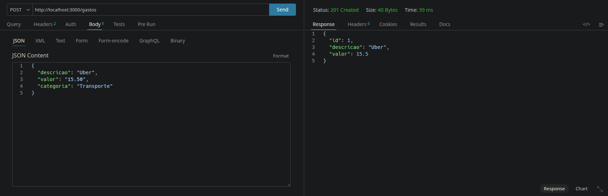
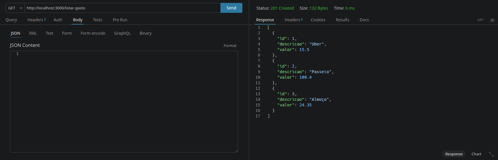
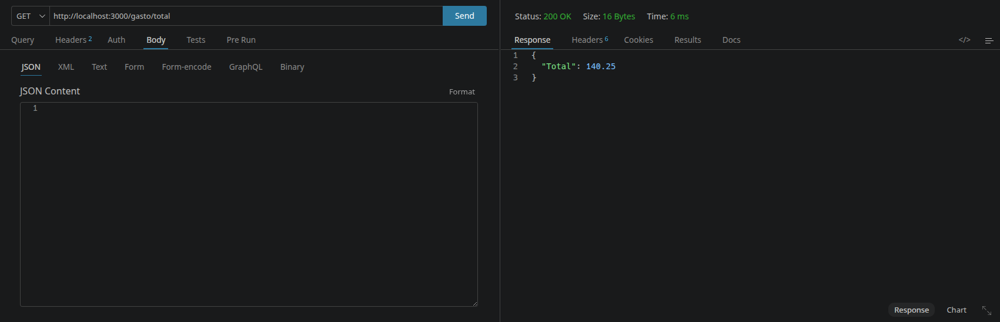

# 💰 API de Controle de Gastos

Este é um projeto fundamental de Controle Financeiro, desenvolvido para consolidar conhecimentos em Node.js e Arquitetura Modular.

Sendo uma aplicação de back-end simplificada, o foco principal foi a organização estrutural do código, dividindo as funções de forma lógica para facilitar a leitura e o crescimento do projeto. A API permite gerenciar entradas de gastos e fornece o cálculo automático do saldo total.

---

## 🚀 Tecnologias Utilizadas

* **Node.js**: Ambiente de execução JavaScript.
* **Express**: Framework para criação de rotas e gerenciamento do servidor.
* **JavaScript (ES Modules)**: Modularização moderna utilizando `import` e `export`.
* **Thunder Client**: Ferramenta utilizada para testes e validação das requisições HTTP.

---

## 📂 Estrutura do Projeto

A organização segue o padrão de separação de interesses (SOC), facilitando a manutenção futura:

```text
api-gastos/
├── controllers/
│   └── UserController.js  # Lógica de negócio, validações e cálculos
├── routes/
│   └── userRoutes.js    # Definição dos endpoints e métodos HTTP
├── img/                 # Capturas de tela da aplicação em funcionamento
├── server.js            # Inicialização do servidor e configuração de middlewares
└── package.json         # Gerenciamento de dependências e scripts
```
---

## 🛠️ Funcionalidades e Demonstração

### 1. Adicionar Gasto
Responsável por receber uma descrição e um valor, validando os dados e armazenando o novo registro.
* **Rota:** `POST /gastos`



### 2. Listar Todos os Gastos
Retorna a lista completa de todos os gastos cadastrados até o momento.
* **Rota:** `GET /listar-gasto`



### 3. Visualizar o Valor Total
Calcula dinamicamente a soma de todos os valores presentes na lista.
* **Rota:** `GET /gasto/total`




---

## ⚙️ Como rodar o projeto

### 1. Clonar o repositório 

`git clone https://github.com/markou66/controle-financeiro-api.git`

---

2. Entrar na pasta

`cd controle-financeiro-api`

---

3. Instalar as dependências

   `npm install`

---

4. Iniciar o servidor

   `node server.js`

---


